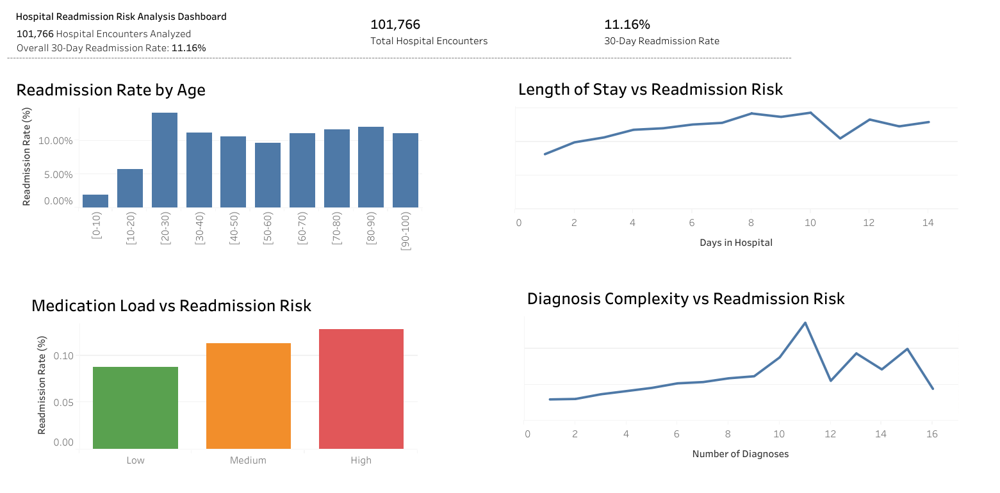

# Hospital Readmission Risk Analysis

## Project Overview

Hospital readmissions are a major concern in healthcare systems because they often indicate complications in patient recovery, ineffective discharge planning, or inadequate follow-up care. Hospitals closely monitor **30-day readmission rates** as a key quality metric.

This project analyses **101,766 hospital encounters** to identify major drivers behind **30-day patient readmissions**. Using **SQL for analysis**, **Excel for risk segmentation**, and **Tableau for visualization**, the study investigates how factors such as age, length of stay, medication load, and disease complexity influence the probability of patient readmission.

The goal is to understand **which patient groups are most at risk of returning to the hospital**, allowing healthcare providers to improve post-discharge care and reduce avoidable readmissions.

---

# Dataset

Dataset: **Diabetes 130-US Hospitals Dataset (1999–2008)**

This dataset contains hospital encounter records of diabetic patients collected across **130 hospitals in the United States**.

### Dataset Size

| Metric | Value |
|------|------|
Total hospital encounters | 101,766 |
Unique patients | 71,518 |
Readmitted within 30 days | 11,357 |
Overall 30-day readmission rate | **11.16%** |

---

# Dataset Columns Used

The dataset contains more than 50 attributes. The following fields were used in this analysis:

| Column | Description |
|------|-------------|
age | Patient age group |
time_in_hospital | Length of hospital stay (days) |
num_medications | Total medications administered |
number_diagnoses | Total diagnoses recorded |
readmitted | Readmission status (NO, >30, <30) |

---

# Data Cleaning

Several preprocessing steps were required before analysis.

### 1. Readmission Label Cleaning

The `readmitted` column contained hidden characters (`\r`) which caused incorrect filtering.

Example values:

```
NO\r
>30\r
<30\r
```

These were cleaned using SQL string functions.

---

### 2. Creating Binary Readmission Flag

To measure readmission risk consistently, a binary variable was created:

| Readmission Status | Flag |
|-------------------|------|
|NO | 0 |
|>30 days | 0 |
|<30 days | 1 |

```
CASE
WHEN readmitted = '<30' THEN 1
ELSE 0
END AS readmission_flag
```

This allowed calculation of **readmission probability using averages**.

---

# Key Metrics

```
Total Encounters: 101,766
30-Day Readmissions: 11,357
Overall Readmission Rate: 11.16%
```

---

# Analysis Performed

The analysis focuses on identifying **key drivers of hospital readmissions**.

Four major dimensions were analysed:

1. Patient demographics  
2. Hospital utilization patterns  
3. Medication intensity  
4. Disease complexity  

---

# 1. Readmission Rate by Age

This analysis measures how readmission probability varies across age groups.

| Age Group | Readmission Rate |
|----------|------------------|
0-10 | 1.86% |
10-20 | 5.79% |
20-30 | 14.24% |
30-40 | 11.23% |
40-50 | 10.60% |
50-60 | 9.67% |
60-70 | 11.13% |
70-80 | 11.77% |
80-90 | 12.08% |
90-100 | 11.10% |

### Insight

Readmission rates increase significantly after early adulthood and remain elevated in older populations.

This indicates that **aging patients tend to require more complex care and follow-up monitoring**.

---

# 2. Length of Stay vs Readmission Risk

The relationship between **hospital stay duration** and readmission probability was analysed.

| Days in Hospital | Readmission Rate |
|-----------------|------------------|
1 | 8.18% |
3 | 10.67% |
5 | 12.03% |
8 | 14.23% |
10 | 14.35% |

### Insight

Longer hospital stays strongly correlate with higher readmission risk.

Patients requiring extended hospital care typically have **more severe conditions or complications**, increasing the likelihood of readmission.

---

# 3. Medication Load vs Readmission Risk

Medication counts were categorized into three groups:

| Medication Band | Patients | Readmission Rate |
|-----------------|---------|------------------|
Low | 20,515 | 8.83% |
Medium | 57,371 | 11.32% |
High | 23,880 | 12.78% |

### Insight

Patients receiving **high medication loads show ~45% higher readmission risk** compared to those receiving fewer medications.

This indicates that **treatment complexity is a strong predictor of hospital return risk**.

---

# 4. Diagnosis Complexity vs Readmission Risk

The number of diagnoses per patient was used as a proxy for **disease complexity (multimorbidity)**.

| Diagnoses | Readmission Trend |
|----------|-------------------|
1-3 | Low risk (~6-7%) |
4-7 | Moderate risk (~9-11%) |
8-10 | Elevated risk (~12-17%) |

### Insight

Patients with multiple comorbidities have a significantly higher probability of readmission.

This pattern highlights **multimorbidity as one of the strongest predictors of hospital readmission**.

---

# Tableau Dashboard

An interactive dashboard was created in **Tableau** to visualize the drivers of hospital readmissions.

View the live dashboard on Tableau Public:

[View Interactive Tableau Dashboard](https://public.tableau.com/views/HospitalReadmissionRiskAnalysis_17729544247920/Dashboard1?:language=en-US&publish=yes&:sid=&:redirect=auth&:display_count=n&:origin=viz_share_link)

---

# Dashboard Preview

Below is a preview of the Tableau dashboard used in this analysis.



The dashboard visualizes:

• Readmission Rate by Age  
• Length of Stay vs Readmission Risk  
• Medication Load vs Readmission Risk  
• Diagnosis Complexity vs Readmission Risk  

The interactive version allows filtering and deeper exploration of **high-risk patient segments**.

---
# Tools Used

| Tool | Purpose |
|-----|--------|
SQL | Data cleaning and analytical queries |
Excel | Risk segmentation and pivot analysis |
Tableau | Data visualization and dashboard creation |

---

# Key Insights

• Overall hospital readmission rate across the dataset is **11.16%**.

• Patients with **longer hospital stays show higher readmission probability**, peaking around 14%.

• **High medication load patients show ~45% higher readmission risk** than low medication patients.

• **Multimorbidity strongly increases readmission risk**, with patients having 10+ diagnoses experiencing significantly higher return rates.

• Readmission risk remains elevated across older age groups, indicating the importance of **post-discharge monitoring for elderly patients**.

---

# Business Impact

Healthcare providers can use these insights to:

• Identify **high-risk patients before discharge**  
• Improve **post-discharge care planning**  
• Allocate **follow-up resources more effectively**  
• Reduce avoidable hospital readmissions

Improving readmission management can significantly reduce **hospital operational costs and patient complications**.
